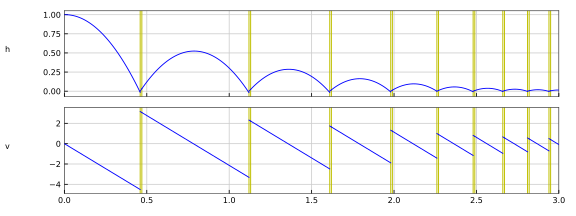

# BouncingBall

The BouncingBall implements the following equation:

```
der(h) =  v
der(v) = -g

when h <= 0    then h := 0 and v := -e * v
when v < v_min then h := 0 and v := 0
```

whith the variables

| Variable | Start | Unit | Causality | Variability | Description    
|:---------| -----:|:-----|-----------|-------------|:---------------
| h        |     1 | m    | output    | continuous  | Distance to the ground
| v        |     0 | m/s  | output    | continuous  | Velocity
| g        |  9.81 | m/s2 | parameter | fixed       | Gravity        
| e        |   0.7 |      | parameter | tunable     | Rebound factor
| v_min    |   0.1 | m/s2 | parameter | constant    | Threshold velocity to stop bouncing

The plot shows the [reference result](BouncingBall_ref.csv) computed with [FMPy](https://github.com/CATIA-Systems/FMPy).


