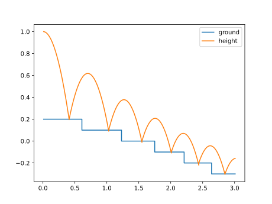

# BouncingBall

The BouncingBall implements the following equation:

```
der(h) = v
der(v) = g

when h <= s(t)    then h := s(t) and v := -e * v
when v < v_min then h := s(t) and v := 0
```

where `s(t)` denotes a stair case function, returning the height of the stair for time `t` and 
with the variables

| Variable | Start | Unit | Causality | Variability | Description
|:---------|------:|:-----|-----------|-------------|:---------------
| h        |     1 | m    | output    | continuous  | Position of the ball
| der(h)   |       | m/s  | local     | continuous  | Derivative of h
| v        |     0 | m/s  | output    | continuous  | Velocity of the ball
| der(v)   |       | m/s2 | local     | continuous  | Derivative of v
| g        | -9.81 | m/s2 | parameter | fixed       | Gravity acting on the ball
| e        |   0.7 |      | parameter | tunable     | Coefficient of restitution
| v_min    |   0.1 | m/s2 | parameter | constant    | Velocity below which the ball stops bouncing

The plot shows the [reference result](BouncingBallStairs_ref.csv).


