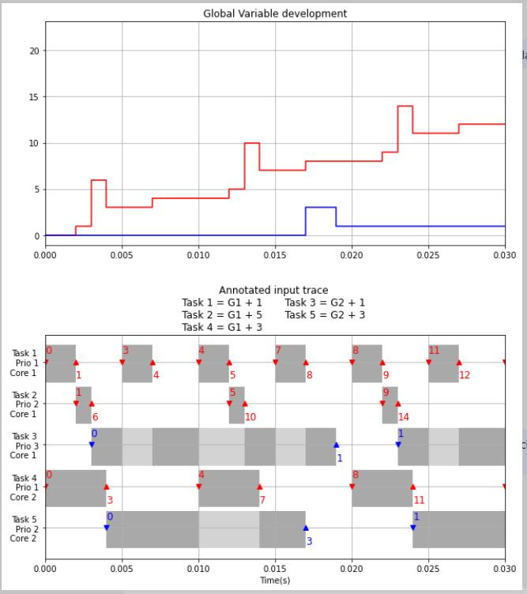

# Communication Event Controlled Clocks
This FMU demonstrates an approach that may be used for timing-accurate simulation of virtual ECUs.
The FMU implements five tasks, each represented with two model partitions, associated to a total of ten triggered input clocks.
The first model partition of each task copies in global labels and performs the computation, but does not deliver the computation results.
The second model partition reads the computation results of the first model partition and performs the copy-out operation.

The FMU is controlled from an FMPy simulation script.
For timing and scheduling information, the script uses a pre-generated trace of communication events.
fmi3DoStep() is used only to advance time, it does not trigger any calculations.

For an implementation of the same functionality using the FMI for Scheduled Execution, see the ControlledClocksSE FMU.

The following plot visualizes the timing-accurate simulation results as annotation of the input trace. 

