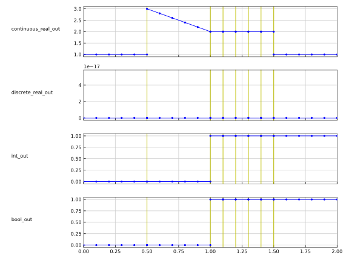

# Feedthrough

| Variable         | Start     | Causality | Variability | Description
|:-----------------| ----------|-----------|-------------|:---------------
| real_fixed_param | 0         | parameter | fixed       | Fixed parameter
| string_param     | "Set me!" | parameter | fixed       | String parameter

In order to reproduce the reference results the following parameters need to be set

```
real_fixed_param: 1
string_param:     "FMI is awesome!"
```

and the [input signals](Feedthrough_in.csv) must be applied.

The plot shows the [reference result](Feedthrough_ref.csv) computed with [FMPy](https://github.com/CATIA-Systems/FMPy).


