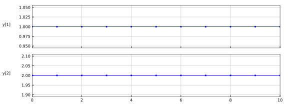

# LinearTransform

Implements the equation

```
y = u * A
```

The plot shows the [reference result](Feedthrough_ref.csv) computed with [simulate_fmi3_me.c](https://github.com/modelica/Reference-FMUs/blob/master/examples/simulate_fmi3_me.c).


