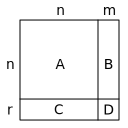

# StateSpace

The StateSpace model implements the equation

```
der(x) = Ax + Bu
    y  = Cx + Du
```

where

- `A` is an `n` by `n` matrix, where `n` is the number of states,
- `B` is an `n` by `m` matrix, where `m` is the number of inputs,
- `C` is an `r` by `n` matrix, where `r` is the number of outputs,
- `D` is an `r` by `m` matrix, and
- `x0` is the initial value of `x`


