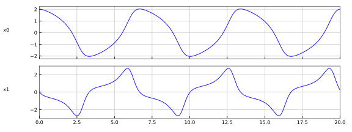

# VanDerPol

The model implements the [Van der Pol oscillator](https://en.wikipedia.org/wiki/Van_der_Pol_oscillator).

```
der(x0) = x1
der(x1) = mu * ((1 - x0 * x0) * x1) - x0
```

whith

| Variable      | Description    | Start |
|:--------------|:---------------| -----:|
| x             | The only state |     1 |
| der(x)        | The derivative |     0 |
| k             | Parameter      |     1 |

The plot shows the [reference result](VanDerPol_ref.csv) computed with [FMPy](https://github.com/CATIA-Systems/FMPy).


