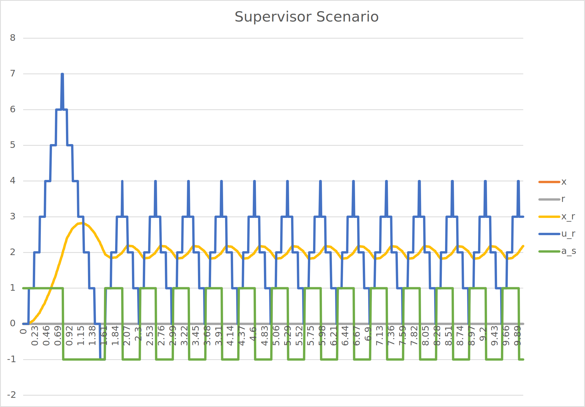

# Synchronous Clock Example Scenario

This example consists of a [Controller](../Controller), a [Plant](../Plant), and a [Supervisor](../Supervisor) FMU.
It uses model exchange in FMI3.0.
The Controller fmu declares an input periodic clock,
and the supervisor has an output clock that triggers when a state event occurs.
The output clock of the supervisor is connected to another input clock of the controller.

The key part of the example is to show that both clocks can activate at the same time,
if the conditions are right (and the conditions are right roughly once per co-simulation).
When that happens, the dependencies between the variables must be taken into account,
in order to correctly propagate the values for the clocked partitions.

The supervisor monitors the plant's continuous output and when a particular event happens,
activates a clock and changes one of the controller's inputs,
which in turn change the controller algorithm.
The plant is just solving a basic ODE with an input from the controller.

The scenario is as follows:

The output should look like:

The result CSV is in [synchronous_control_me_out.csv](synchronous_control_me_out.csv)
